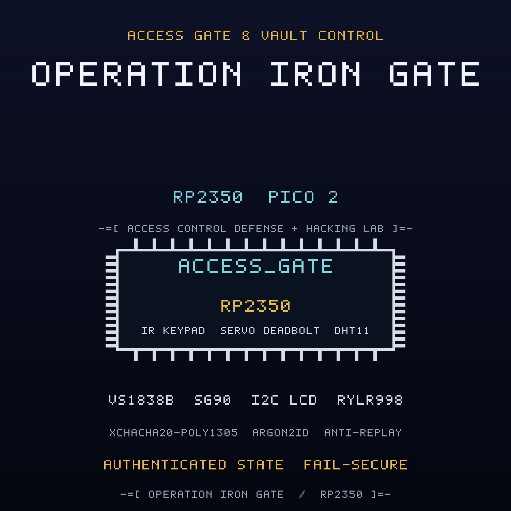

<br>

## FREE Reverse Engineering Self-Study Course [HERE](https://github.com/mytechnotalent/reverse-engineering)
## FREE Embedded Hacking Course [HERE](https://github.com/mytechnotalent/Embedded-Hacking)

<br>

# OPERATION IRON GATE CTF

### Act II - The compromised access gate and vault control

<br>

***
**LEGAL DISCLAIMER:**
The information, tools, and code provided in this repository and course are strictly for educational, research, and defensive purposes only. 

You are explicitly prohibited from using any materials contained herein to access, test, modify, or exploit any device, network, or system that you do not own 100% or for which you do not have explicit, documented, and legally binding authorization to interact with.

By using this repository and course, you acknowledge and agree that:

1. Any illegal, unauthorized, or malicious use of this information is solely your responsibility.
2. The author(s) and contributor(s) of this repository and course shall not be held liable for any damages, legal repercussions, criminal charges, or unauthorized actions resulting from the use, misuse, or abuse of the contents herein.
3. You will comply with all applicable local, state, national, and international laws regarding cybersecurity and computer fraud.

**IF YOU DO NOT AGREE WITH THESE TERMS, DO NOT USE THIS REPOSITORY AND COURSE.**
***

<br>
<br>

> Hello, friend.
>
> In Act I you learned that a sensor can lie. It reported minus eighteen while
> the store warmed, and the lie was the product. This is the second lesson. The
> door.
>
> The frame you pulled out of the monitor led somewhere. A NorthPharma logistics
> annex with one entrance and no windows. NIGHTINGALE sent her last ping from
> inside it, then went quiet. FROSTLINE is already wiping the site. WHITEOUT has
> until dawn.
>
> The only way in is the access gate. A keypad nobody watches, a deadbolt on a
> servo, and an audit uplink that is supposed to tell the truth about who came
> through. The gate keeps its final verdict in plain SRAM, and the cryptography
> around it is perfect. So the door trusts a boolean.
>
> You have her binary. You have the breadboard. You have a debug probe. What you
> do not have is time.

This is the companion capture-the-flag to the
[access-gate](https://github.com/mytechnotalent/access-gate) project. Where the
project builds the defended device, this CTF hands you the **compromised** gate
that FROSTLINE shipped and asks you to find every defect, prove it on real
hardware, and patch the image.

<br>

## THE MISSION

The `ACT-II.bin` image is the OPERATION IRON GATE gate with **four deliberate
defects**. Each defect is an in-place, same-size byte patch, so no address moves
when you fix it. Every fix is provable on a Pico 2 with a Debug Probe.

| # | Name | What FROSTLINE did |
| - | ---- | ------------------ |
| 1 | Replay | inverted the anti-replay branch so a captured grant reopens the door |
| 2 | Forge | inverted the AEAD tag branch so a forged grant authenticates |
| 3 | State | bypassed the authenticated-state check so a debugger can set the verdict |
| 4 | Fail-open | inverted the fail-mode branch so an authorization timeout unlocks the bolt |

The wire is sealed with XChaCha20-Poly1305, keyed through Argon2id. The
cryptography is correct. The four defects are not in the cipher. They are in the
stateful policy wrapped around it: freshness, authenticity, state integrity, and
fail mode. Read the dead, find the doors, and lock them.

<br>

## THE ARTIFACTS

| File | Role | SHA-256 |
| ---- | ---- | ------- |
| `ACT-II.bin` | compromised firmware, the target | `da216cff3f569983dcf7d5e14d192c23d491ea8126abee8d4c153c58f8d5a282` |
| `ACT-II.uf2` | flashable image of the target | `ad146617c91d96445df0ebbad4c9e282c2cdc011de985a343323d3df107856ec` |
| `ACT-II_fixed.bin` | corrected firmware, the solution | `3deba303f5daa5b48a6fda2c583cff76916ea7012a7b2bbb8f9ea4b71372d304` |
| `ACT-II_fixed.uf2` | flashable image of the solution | `d8789dd83098b421ea669015873bb499ccb39c2571ecc54f51b30f6e7b2bf7fe` |

The two `.bin` files differ in exactly four bytes at offsets
`0x7F43, 0x811D, 0x6797, 0x6BCB`.

<br>

## THE DOCUMENTS

| Document | For |
| -------- | --- |
| [`ACT-II-I.md`](ACT-II-I.md) | Student instructions: the scenario, the tasks, the wiring |
| [`ACT-II-R.md`](ACT-II-R.md) | Requirements and grading criteria |
| [`ACT-II-S.md`](ACT-II-S.md) | Instructor solution key with exact offsets and bytes |
| [`ACT-II-main-disasm.txt`](ACT-II-main-disasm.txt) | Annotated disassembly of the four sabotage sites |
| [`DESIGN.md`](DESIGN.md) | Build blueprint (instructor eyes only) |

<br>

## HARDWARE

Everything runs on the Embedded Hacking breadboard, and the pin map is identical
to Act I so one board serves both chapters: a Pico 2, a Debug Probe, a DHT11
vault interlock on GP4, a 1602 I2C LCD access log on GP2/GP3 at address `0x27`,
three status LEDs (red GP16 DENIED, yellow GP17 PENDING, green GP18 GRANTED), a
request-to-exit button on GP15, an SG90 deadbolt servo on GP14 with a 1000uF
cap, a VS1838B infrared badge and PIN keypad on GP5, and an RYLR998 LoRa
authorization and audit uplink on UART1 GP8/GP9. Request-to-exit is
intentionally unauthenticated for life safety and is not a defect. The pin map
is in the instructions.

<br>

## QUICK START

Verify the two images against the expected patches and hashes:

```bash
python3 scripts/verify_ctf.py
```

Expected:

```text
10/10 checks passed
```

Build the corrected firmware from source:

```bash
rm -rf build && cmake -S . -B build -G Ninja -DPICO_BOARD=pico2 -DPICO_PLATFORM=rp2350-arm-s && cmake --build build
```

Run the firmware code standard audit:

```bash
python3 scripts/audit_c_standard.py
```

<br>

## REPOSITORY LAYOUT

```text
ACT-II-I.md               student instructions
ACT-II-R.md               requirements and grading criteria
ACT-II-S.md               instructor solution key
ACT-II.bin / .uf2         compromised artifact
ACT-II_fixed.bin / .uf2   corrected artifact
ACT-II-main-disasm.txt    annotated sabotage sites
scripts/verify_ctf.py     machine verifier
scripts/spoof.py          framed for the classroom attack labs
src/  include/            firmware sources
CMakeLists.txt            Pico SDK build
DESIGN.md                 build blueprint
```

<br>

## WHERE THIS FITS: OPERATION COLD IRON

This is the companion CTF for **Act II (IRON GATE)** of the ten-act OPERATION COLD
IRON saga. The project it attacks is
[access-gate](https://github.com/mytechnotalent/access-gate). The full spine is in
[SAGA.md](SAGA.md).

- Previous act: Act I, COLD IRON, [CTF_cold-chain-monitor](https://github.com/mytechnotalent/CTF_cold-chain-monitor)
- This act: Act II, IRON GATE
- Next act: Act III, IRON VEIN (forthcoming)


<br>

## THE MINISTRY

The Ministry runs the state: the surveillance, the cold chain, the gates, the
pipelines. NorthPharma is one of its deniable industrial fronts, and FROSTLINE is
the contractor that does the work no Ministry letterhead will admit to. Against
them is WHITEOUT, and the engineer who copied this image, NIGHTINGALE. This act is
one node of the Ministry's industrial edge. TELESCREEN, the surveillance backbone
that watches it, comes after the ten.


<br>

## THE ROADMAP

OPERATION IRON GATE is Act II of **OPERATION COLD IRON** and the sixth
investigation in the Embedded Hacking series. Act I was the sensor
([cold-chain-monitor](https://github.com/mytechnotalent/cold-chain-monitor)).
Act II is the door. This CTF is the red half, weaponized: four deep defects, each
with a static analysis, a dynamic proof under GDB, a hardware demonstration, and
an in-place, same-size patch.

- Project repository: [github.com/mytechnotalent/access-gate](https://github.com/mytechnotalent/access-gate)
- This CTF repository: [github.com/mytechnotalent/CTF_access-gate](https://github.com/mytechnotalent/CTF_access-gate)

<br>

# Next
[OPERATION IRON VEIN](https://github.com/mytechnotalent/pipeline-valve-controller)

<br>

# License
[MIT License](https://github.com/mytechnotalent/CTF_access-gate/blob/main/LICENSE)
